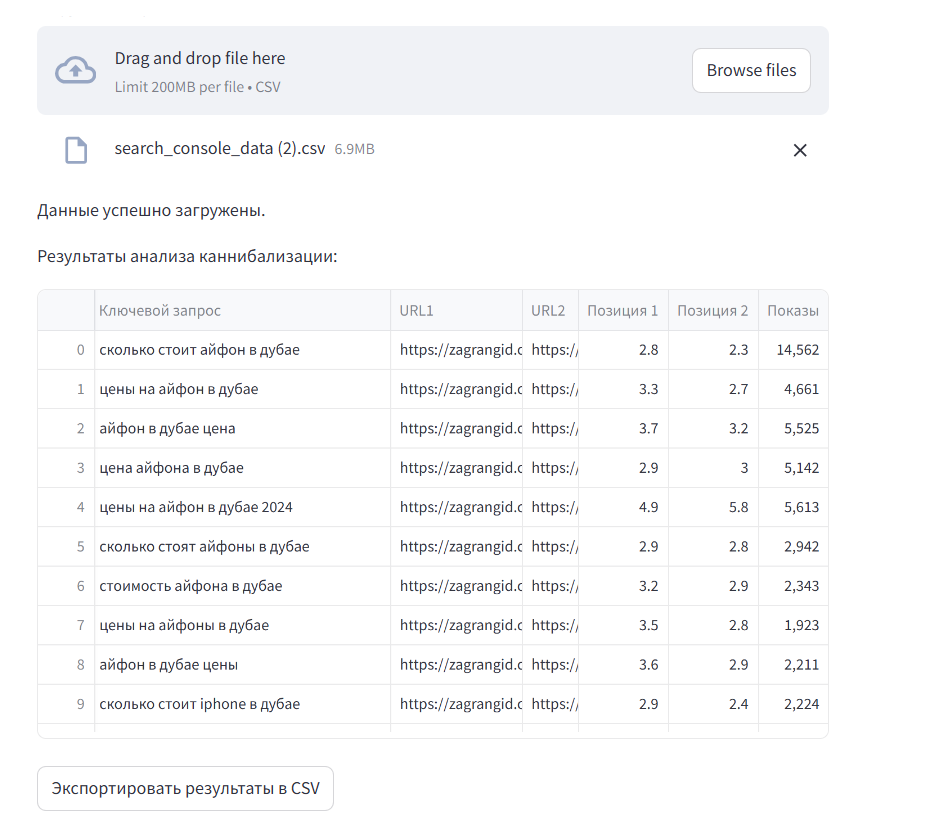

# Анализ каннибализации ключевых запросов

Этот проект на **Streamlit** анализирует данные из Google Search Console на предмет каннибализации ключевых запросов, выявляя случаи, когда один запрос продвигается на нескольких URL. 
CVS файл можно получить с помощью этого [скрипта](https://github.com/Devvver/google_console__key_extractor/)
Скрипт создан для канала [ChatGPT, AI, Python для SEO](https://t.me/python_seo).  
Подписывайтесь, чтобы получать больше полезных инструментов и идей для автоматизации SEO-задач!





## Функционал

- Загрузка CSV-файла с данными из Google Search Console.
- Фильтрация по минимальному количеству показов.
- Выявление каннибализации с расчетом показов, кликов и средней позиции.
- Вывод результатов в интерактивной таблице.
- Экспорт отчета в формате CSV.

## Использование

1. Убедитесь, что CSV-файл содержит следующие столбцы:
   - `Ключевой запрос`
   - `URL`
   - `Клики`
   - `Показы`
   - `Позиция`

2. Запустите приложение:
   ```bash
   streamlit run app.py

